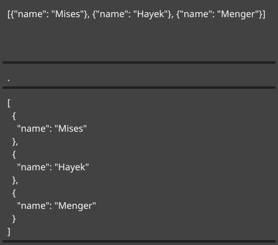
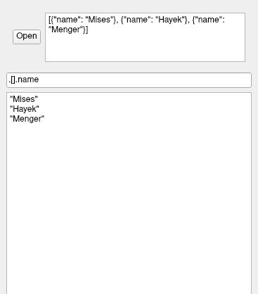

# ./jqview [](https://github.com/fiatjaf/awesome-jq)

The simplest possible native GUI for inspecting JSON objects with [jq](https://stedolan.github.io/jq/manual/).

Made with [Qt](https://qt.io/) and [gojq](https://github.com/itchyny/gojq).

## Usage

```
~> echo '[{"name": "Mises"}, {"name": "Hayek"}, {"name": "Menger"}]' | jqview
```



```
~> echo '[{"name": "Mises"}, {"name": "Hayek"}, {"name": "Menger"}]' | jqview '.[].name'
```



```
~> echo '[{"name": "Mises"}, {"name": "Hayek"}, {"name": "Menger"}]' > names.json
~> jqview 'map(select(.name | startswith("M")))' names.json
```


## Installation

Download from [releases](https://github.com/fiatjaf/jqview/releases), or compile using instructions from [this table](https://github.com/therecipe/qt/wiki/Deploying-Application).
